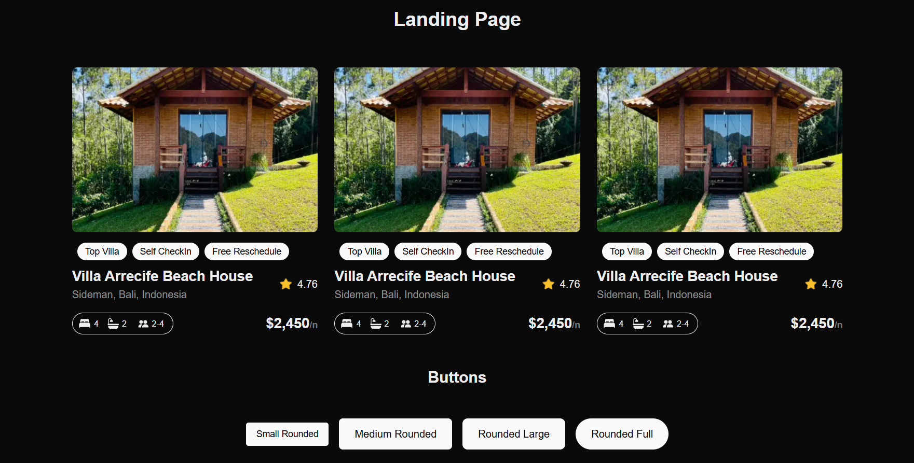

# ALX UI System – Project 0x00

<p align="left">
  
  
  
  
</p>

A modern, responsive UI system built using **Next.js**, **TypeScript**, and **Tailwind CSS**. This project features reusable components like cards and buttons, a landing page, and theme toggling between light and dark modes.

---

## 🚀 Features

- ⚡ Built with Next.js & TypeScript  
- 🎨 Tailwind CSS for utility-first styling  
- 🌗 Light/Dark mode toggle with Tailwind's dark class  
- 🧱 Reusable UI Components (`Card`, `Button`, `ThemeToggle`)  
- 📱 Responsive layout for all screen sizes  
- ✨ Minimal, developer-friendly setup

---

## 📦 Technologies Used

| Tech           | Purpose                            |
|----------------|------------------------------------|
| **Next.js**    | React framework for server-side rendering and routing  
| **TypeScript** | Typed superset of JavaScript  
| **Tailwind CSS** | Utility-first CSS framework  
| **ESLint**     | Code linting and style enforcement  
| **Node.js**    | Environment and package manager  

---

## 🛠️ Getting Started

### 1. Clone the Repository

```bash
git clone https://github.com/your-username/alx-project-0x00.git
cd alx-project-0x00
```

## 📦 2. Install Dependencies

```bash
npm install
```

## 🏁 3. Run the Development Server

```bash
npm run dev
```

Then open your browser at: [http://localhost:3000](http://localhost:3000)

---

## 📁 Project Structure

```
alx-project-0x00/
├── components/        # Reusable UI components
│   ├── Button.tsx
│   ├── Card.tsx
│   └── Pill.tsx
│
├── pages/             # Application pages
│   ├── index.tsx
│   └── landing.tsx
│
├── public/            # Static assets
├── styles/            # Global styles (Tailwind CSS)
│   └── globals.css
│
├── .eslintrc.json     # Linter configuration
├── tailwind.config.js # Tailwind setup
├── tsconfig.json      # TypeScript configuration
└── README.md
```

---

## 🧩 Components Overview

### 📦 `Card`

A reusable card UI with title and description:

```tsx
<Card title="Card Title" description="This is a card description." />
```

---

### 🔘 `Button`

Multiple button styles for different UI needs:

```tsx
<Button title="Small Rounded" />
<Button title="Rounded Full" />
```

---

## 🎯 Learning Objectives

By completing this project, you'll:

- Scaffold a modern Next.js project with TypeScript and Tailwind CSS
- Create clean, modular UI components
- Implement light/dark themes
- Apply responsive design principles
- Understand file structure and component-based architecture
- Maintain code quality using ESLint

---

## 📸 Screenshots

